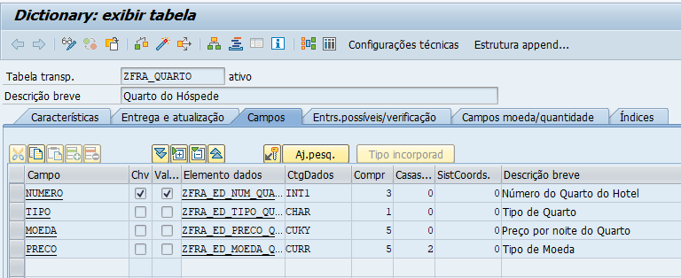
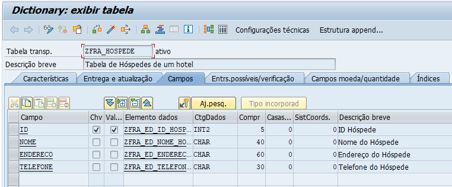
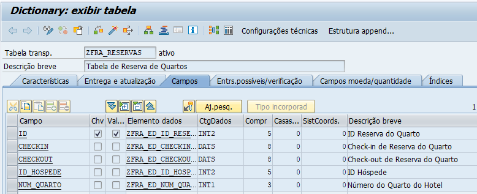

 Programa Feito 2 de Abril 

# Programa de Cadastro de Reservas em um Hotel (com Carga de CSV/Excel)

Programa ABAP para aprender a funcionalidade de Carga dos Arquivos Excel

## Tabelas

Na realização desse programa, foram criados tabelas para representarem os objetos principais do programa, os Quartos, Hóspedes e Reservas de Quartos.

### Tabela de Quarto

### Tabela de Hóspede

### Tabela de Reservas

## Conhecimentos adquiridos para o programa

- Da função WS_UPLOAD ao Método GUI_UPLOAD para Leitura de arquivos

- Tabela SSCRFIELDS e tipo FUNCTXT para definir botões na Tela de Seleção
- Value Request e Função F4_FILENAME para buscar dados através de um Matchcode
